# Table of Contents

- [Table of Contents](#table-of-contents)
  - [Introduction](#introduction)
  - [Prerequisites](#prerequisites)
    - [.NET 6.0](#net-60)
    - [Visual Studio 2022 Preview](#visual-studio-2022-preview)
    - [ASP.NET and web development Workload](#aspnet-and-web-development-workload)
    - [FFmpegBlazor](#ffmpegblazor)
  - [Demo](#demo)
    - [Create a Blazor WebAssembly Application](#create-a-blazor-webassembly-application)
    - [Logger Component](#logger-component)
    - [Concatenate Videos](#concatenate-videos)
  - [Summary](#summary)
  - [Complete Code](#complete-code)
  - [Resources](#resources)

## Introduction

In this episode, we are going to build a REPLACE_HERE.

End results will look like this:


Let's get to it.

## Prerequisites

The following prerequisites are needed for this demo.

### .NET 6.0

Download the latest version of the .NET 6.0 SDK [here](https://dotnet.microsoft.com/en-us/download).

### Visual Studio 2022 Preview

For this demo, we are going to use the latest version of [Visual Studio 2022 Preview](https://visualstudio.microsoft.com/vs/community/).

### ASP.NET and web development Workload

In order to build Blazor apps, the `ASP.NET and web development` workload needs to be installed, so if you do not have that installed let's do that now.

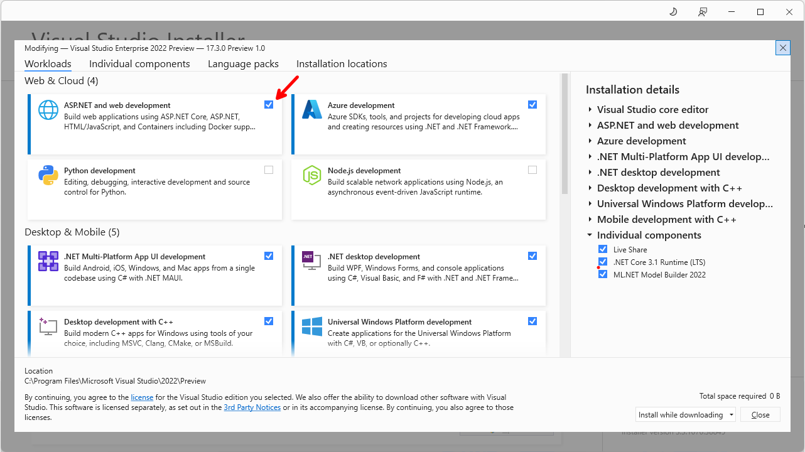  

### FFmpegBlazor

We are also going to use the [FFmpegBlazor](https://www.nuget.org/packages/FFmpegBlazor/) NuGet package for this demo.

## Demo

In the following demo we will create a Blazor WebAssembly application, and I will show you how to use `FFmpegBlazor` to edit video and audio right from the browser.

### Create a Blazor WebAssembly Application

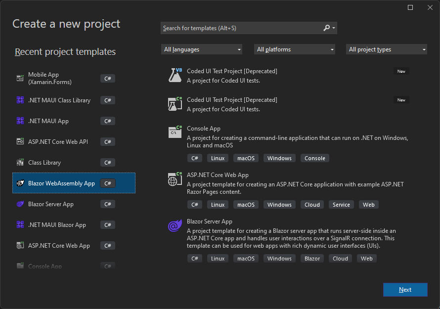  

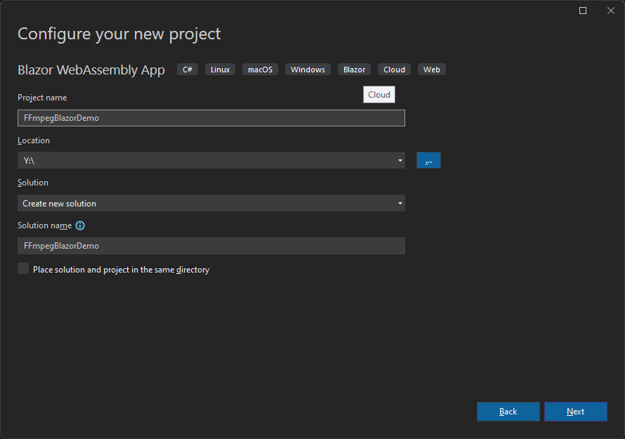  

Add a NuGet reference to `FFmpegBlazor` library.

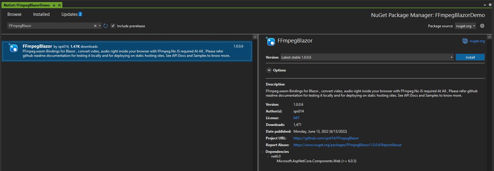  

>:blue_book: You can also run `dotnet add package FFmpegBlazor` from the NuGet Package Explorer or the `Command Prompt`.

From the `FFmpegBlazor` NuGet docs:

>"FFmpegBlazor provides ability to utilize ffmpeg.wasm from Blazor Wasm C#.
ffmpeg.wasm is a pure Webassembly / Javascript port of FFmpeg. It enables video & audio record, convert and stream right inside browsers.
FFmpegBlazor integrates nicely with Blazor InputFile Component. Supports Lazy loading of ffmpeg binary. It is self hosted version one time download of core ffmpeg wasm lib will be 25Mb."

What that means is, on first load, we are only going to see a couple of tiny JavaScript files being downloaded.

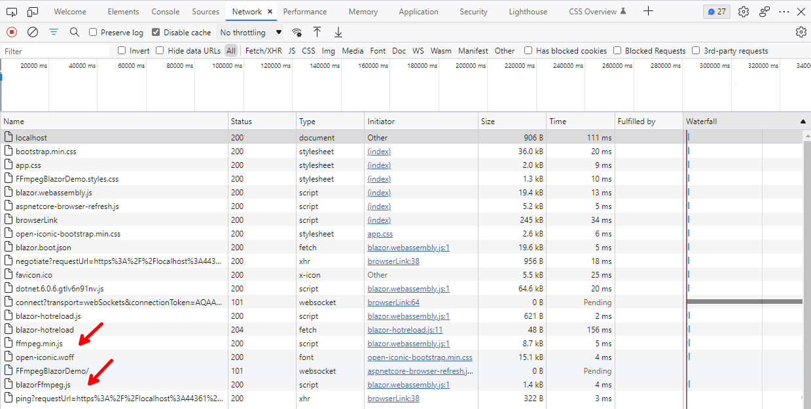  

Then, when we actually use the library, the 25 MB core FFmpeg WASM library will be downloaded, on demand.

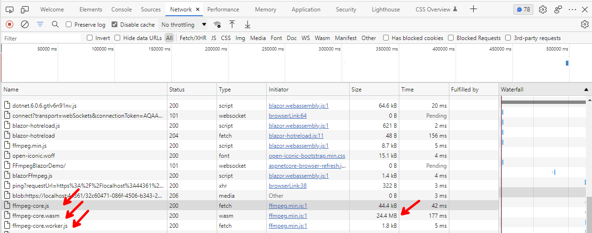  

So, let's give it a try!

First thing we have to do, after adding the package, is to implement a workaround, which will not be needed after .NET 7, once Multi-threading support becomes available in WASM.

This is to avoid a `SharedArrayBuffer not defined` exception that you will get otherwise.

The workaround is to add two headers in Blazor WASM local-server, as well as when deployed in static server.

1. Cross-Origin-Embedder-Policy: require-corp
2. Cross-Origin-Opener-Policy: same-origin

One easy way to do that, is to add a **web.config** file to the root of our project, with the following content:

```xml
<?xml version="1.0" encoding="utf-8"?>
<configuration>
	<system.webServer>
		<httpProtocol>
			<customHeaders>
				<add name="Cross-Origin-Embedder-Policy" value="require-corp"/>
				<add name="Cross-Origin-Opener-Policy" value="same-origin"/>
			</customHeaders>
		</httpProtocol>
	</system.webServer>
</configuration>
```

And make sure `Build Action` is set to `Content`, and `Copy to Output Directory` is set to `Copy if newer`.

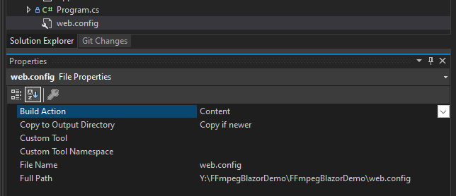  

Finally, you will have to run the application in `IIS Express`, so let's change that so we do not forget later.

From:

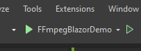  

To:

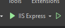  

Now we are ready to give it a try!

The first demo we are going to do, is to replicate the sample code in the NuGet package docs, with some enhancements.

### Logger Component

The sample demo in the NuGet package docs, is logging data to the browser's console logs, let's create a `Logger` component, so we can see the logs right on the page, as well as as progress indicator.

Add a **Logger.razor** component to the **Shared** folder, with the following code:

```razor
<div style="position: absolute; bottom: 0px;">
    <h3>Logs @Progress</h3>
    <textarea rows="@Rows" cols="300" readonly style="font-family:Lucida Sans Typewriter; font-size:12px;">
        @LogMessages
    </textarea>
</div>

@code {
    [Parameter]
    public int Rows { get; set; } = 20;

    [Parameter]
    public string Progress { get; set; } = string.Empty;

    [Parameter]
    public string LogMessages { get; set; } = string.Empty;
}
```

As you can see, we have added three parameters `Rows` to indicate how many rows for the logging messages we can display, `Progress` to indicate completion progress when processing a file, and `LogMessages` to display logging entries.

Now, go to the **Pages/index.razor** page and replace the code with this code:

```razor
@page "/"
@using FFmpegBlazor
@inject IJSRuntime Runtime
@using Microsoft.AspNetCore.Components.Forms
@implements IDisposable

<PageTitle>Convert to MP3</PageTitle>

<h1>Convert MP4 to MP3</h1>

<InputFile OnChange="LoadVideoFile" />
<br />
<br />
<video width="300" height="200" autoplay controls src="@videoInputUrl" />
<br />
<br />
<input type="checkbox" @bind-value="@download" />&nbsp;Download Output File
<br />
<br />
<button class="btn btn-primary" @onclick="Process">Convert to MP3</button>
<br />
<br />
<audio controls src="@audioOutputUrl" />

<br />
<Logger LogMessages="@logMessages" Progress="@progress" Rows="35"/>

@code
{
    FFMPEG? ffMpeg;
    byte[]? videoBuffer;
    string? videoInputUrl = string.Empty;
    string audioOutputUrl = string.Empty;
    string logMessages = string.Empty;
    string progress = string.Empty;
    bool download = false;
    const string inputFile = "input.mp4";
    const string outputFile = "output.mp3";

    protected override async Task OnInitializedAsync()
    {
        // Wire-up events
        if (FFmpegFactory.Runtime == null)
        {
            FFmpegFactory.Logger += LogToConsole;
            FFmpegFactory.Progress += ProgressChange;
        }

        // Initialize Library
        await FFmpegFactory.Init(Runtime);
    }


    private async void LoadVideoFile(InputFileChangeEventArgs v)
    {
        // Clear logs and progress
        logMessages = string.Empty;
        progress = string.Empty;

        // Get first file from input selection
        var file = v.GetMultipleFiles()[0];

        // Read all bytes
        using var stream = file.OpenReadStream(100000000); //Max size for file that can be read
        videoBuffer = new byte[file.Size];

        // Read all bytes
        await stream.ReadAsync(videoBuffer);

        // Create a video link from the buffer, so that video can be played
        videoInputUrl = FFmpegFactory.CreateURLFromBuffer(videoBuffer, inputFile, file.ContentType);

        // Rerender DOM
        StateHasChanged();
    }

    private async void Process()
    {
        // Create an instance of FFmpeg
        ffMpeg = FFmpegFactory.CreateFFmpeg(new FFmpegConfig() { Log = true });

        // Download all dependencies from the CDN
        await ffMpeg.Load();

        if (!ffMpeg.IsLoaded) return;

        // Write buffer to in-memory files (special emscripten files, FFmpeg only interact with this file)
        ffMpeg.WriteFile(inputFile, videoBuffer);

        // Pass CLI argument here equivalent to ffmpeg -i inputFile.mp4 outputFile.mp3
        await ffMpeg.Run("-i", inputFile, outputFile);

        // Delete in-memory file
        ffMpeg.UnlinkFile(inputFile);
    }

    private async void ProgressChange(Progress message)
    {
        // Display progress % (0-1)
        progress = $"Progress: {message.Ratio.ToString("P2")}";
        Console.WriteLine(progress);
        LogToUi(progress);

        // If FFmpeg processing is complete (generate a media URL so that it can be played or alternatively download that file)
        if (message.Ratio == 1)
        {
            progress = $"Progress: 100%";

            // Get a bufferPointer from C WASM to C#
            var res = await ffMpeg!.ReadFile(outputFile);

            // Generate a URL from the file bufferPointer
            audioOutputUrl = FFmpegFactory.CreateURLFromBuffer(res, outputFile, "audio/mp3");

            // Download the file
            if (download)
            { 
                FFmpegFactory.DownloadBufferAsFile(res, outputFile, "audio/mp3");
            }

            // Rerender DOM
            StateHasChanged();
        }
    }

    private void LogToConsole(Logs message)
    {
        var logMessage = $"{message.Type} {message.Message}";
        Console.WriteLine(logMessage);
        LogToUi(logMessage);
    }

    private void LogToUi(string message)
    {
        logMessages += $"{message}\r\n";
        // Rerender DOM
        StateHasChanged();
    }

    public void Dispose()
    {
        FFmpegFactory.Logger -= LogToConsole;
        FFmpegFactory.Progress -= ProgressChange;
    }
}
```

Most of the code has comments, but some of the most important pieces are:

- Injecting `IJSRuntime` with `@inject IJSRuntime Runtime` to be able to call `FFmpegBlazor` `JavaScript functions.
- Initialization of `FFmpegFactory` with `FFmpegFactory.Init(Runtime)`.
- Wiring-up of `Logger` and `Progress` events.
- Creating an instance of `FFmpeg` with `ffMpeg = FFmpegFactory.CreateFFmpeg(new FFmpegConfig() { Log = true });`.
- Executing `FFmpeg` functions like `WriteFile` and `Run`.

>:blue_book: With `ffMpeg.Run` we can potentially run any `FFmpeg` arguments, which makes `FFmpegBlazor` very powerful. Refer to the official `FFmpeg` documentation [here](https://ffmpeg.org/ffmpeg.html) for more information.

Let's get rid of **Pages/FetchData.razor** and, **Shared/SurveyPrompt.razor**, we are not going to need them.

Update the **Pages/NavMenu.razor** with this code:

```razor
<div class="top-row ps-3 navbar navbar-dark">
    <div class="container-fluid">
        <a class="navbar-brand" href="">FFmpegBlazor Demo</a>
        <button title="Navigation menu" class="navbar-toggler" @onclick="ToggleNavMenu">
            <span class="navbar-toggler-icon"></span>
        </button>
    </div>
</div>

<div class="@NavMenuCssClass" @onclick="ToggleNavMenu">
    <nav class="flex-column">
        <div class="nav-item px-3">
            <NavLink class="nav-link" href="" Match="NavLinkMatch.All">
                <span class="oi oi-musical-note" aria-hidden="true"></span> Convert to MP3
            </NavLink>
        </div>
    </nav>
</div>

@code {
    private bool collapseNavMenu = true;

    private string? NavMenuCssClass => collapseNavMenu ? "collapse" : null;

    private void ToggleNavMenu()
    {
        collapseNavMenu = !collapseNavMenu;
    }
}
```

Now let's run the app. You will be presented with this:

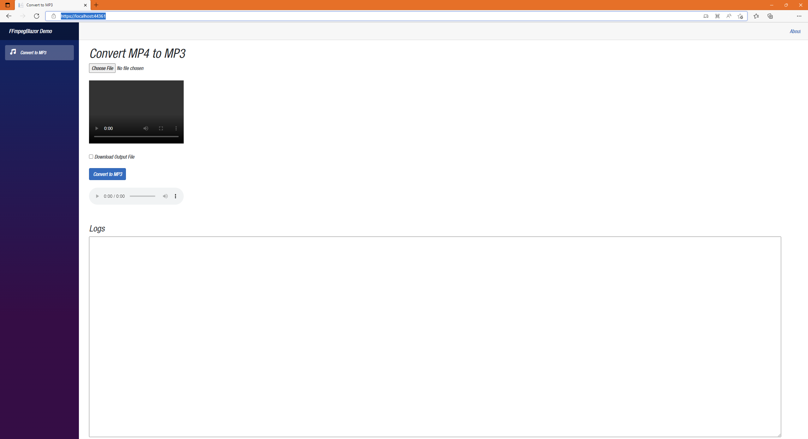  

Click on `Choose File` to select an MP4 video file. The file will load and play on the Video player. You have the option to just convert the file to MP3, or convert and download by checking the `Download Output File` box, let's check the box and click on `Convert to MP3`.

You will see the log entries, progress completed, the downloaded **output.mp3** file, and the Audio player ready to play the MP3 file.

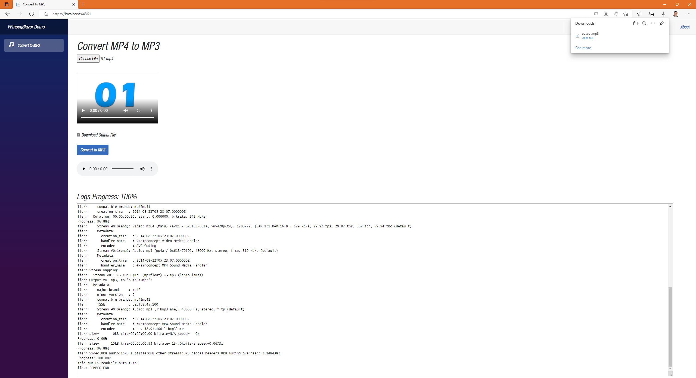  

So, what else can we do with `FFmpegBlazor`? How about concatenating two videos together? Let's do that now.

### Concatenate Videos

In this demo, we are going to take any two random videos, and concatenate them together, one after the other one.

For simplicity, I will create an independent demo that will work on it's own, so let's duplicate **Pages/index.razor**, and call the new file **Pages/Concatenate.razor** and replace the code with this:

```razor
@page "/concatenate"
@using FFmpegBlazor
@using Microsoft.AspNetCore.Components.Forms
@implements IDisposable

<PageTitle>Concatenate Videos</PageTitle>

<h1>Concatenate Videos</h1>

<div class="row">
    <div class="col-3">
        <InputFile OnChange="LoadVideoFile1" />
        <br />
        <br />    
        <video width="300" height="200" autoplay controls src="@videoInputUrl1" />
    </div>

    <div class="col-9" style="text-align:left;">
        <InputFile OnChange="LoadVideoFile2" />
        <br />
        <br />
        <video width="300" height="200" autoplay controls src="@videoInputUrl2" />
    </div>
</div>
<br />
<br />
<input type="checkbox" @bind-value="@download" />&nbsp;Download Output File
<br />
<br />
<button class="btn btn-primary" @onclick="Process">Concatenate Videos</button>
<br />
<br />
<video width="300" height="200" autoplay controls src="@videoOutputUrl" />
<br />
<br />
<Logger LogMessages="@logMessages" Progress="@progress" Rows="20" />

@code
{
    FFMPEG? ffMpeg;
    byte[]? videoBuffer1;
    byte[]? videoBuffer2;
    string videoInputUrl1 = string.Empty;
    string videoInputUrl2 = string.Empty;
    string videoOutputUrl = string.Empty;
    string logMessages = string.Empty;
    string progress = string.Empty;
    bool download = false;
    const string inputFile1 = "videoInput1.mp4";
    const string inputFile2 = "videoInput2.mp4";
    const string outputFile = "output.mp4";

    protected override void OnInitialized()
    {
        // Wire-up events
        if (FFmpegFactory.Runtime != null)
        {
            FFmpegFactory.Logger += LogToConsole;
            FFmpegFactory.Progress += ProgressChange;
        }
        base.OnInitialized();
    }

    private async void LoadVideoFile1(InputFileChangeEventArgs v)
    {
        // Clear logs and progress
        logMessages = string.Empty;
        progress = string.Empty;

        // Unlink files if previously called
        if (ffMpeg != null)
        {
            if (videoInputUrl1 != string.Empty)
            {
                videoInputUrl1 = "";
                ffMpeg.UnlinkFile(inputFile1);
            }

            if (inputFile2 != string.Empty)
            {
                videoInputUrl2 = "";
                ffMpeg.UnlinkFile(inputFile2);
            }
        }

        // Get first file from input selection
        var file = v.GetMultipleFiles()[0];

        // Read all bytes
        using var stream = file.OpenReadStream(100000000); //Max size for file that can be read
        videoBuffer1 = new byte[file.Size];

        // Read all bytes
        await stream.ReadAsync(videoBuffer1);

        // Create a video link from the buffer, so that video can be played
        videoInputUrl1 = FFmpegFactory.CreateURLFromBuffer(videoBuffer1, inputFile1, file.ContentType);

        // Rerender DOM
        StateHasChanged();
    }

    private async void LoadVideoFile2(InputFileChangeEventArgs v)
    {
        // Get first file from input selection
        var file = v.GetMultipleFiles()[0];

        // Read all bytes
        using var stream = file.OpenReadStream(100000000); //Max size for file that can be read
        videoBuffer2 = new byte[file.Size];

        // Read all bytes
        await stream.ReadAsync(videoBuffer2);

        // Create a video link from the buffer, so that video can be played
        videoInputUrl2 = FFmpegFactory.CreateURLFromBuffer(videoBuffer2, inputFile2, file.ContentType);

        // Rerender DOM
        StateHasChanged();
    }

    private async void Process()
    {
        // Create an instance of FFmpeg
        ffMpeg = FFmpegFactory.CreateFFmpeg(new FFmpegConfig() { Log = true });

        // Download all dependencies from the CDN
        await ffMpeg.Load();

        if (!ffMpeg.IsLoaded) return;

        // Write buffer to in-memory files (special emscripten files, FFmpeg only interact with this file)
        ffMpeg.WriteFile(inputFile1, videoBuffer1);
        ffMpeg.WriteFile(inputFile2, videoBuffer2);

        // Pass CLI argument here equivalent to ffmpeg -i inputFile1.mp4 -i inputFile2.mp4 outputFile.mp3 -filter_complex concat=n=2:v=1:a=0 -vn -y output.mp4
        await ffMpeg.Run("-i", inputFile1, "-i", inputFile2, "-filter_complex", "concat=n=2:v=1:a=0", "-vn", "-y", outputFile);

        // Delete in-memory files
        ffMpeg.UnlinkFile(inputFile1);
        ffMpeg.UnlinkFile(inputFile2);
    }

    private async void ProgressChange(Progress message)
    {
        // Display progress % (0-1)
        var progressRatio = message.Ratio <= 0 ? 0 : message.Ratio >= 100 ? 100 : message.Ratio;
        progress = $"Progress: {progressRatio.ToString("P2")}";
        Console.WriteLine(progress);
        LogToUi(progress);

        // If FFmpeg processing is complete (generate a media URL so that it can be played or alternatively download that file)
        if (message.Ratio == 1)
        {
            progress = $"Progress: 100%";

            // Get a bufferPointer from C WASM to C#
            var res = await ffMpeg!.ReadFile(outputFile);

            // Generate a URL from the file bufferPointer
            videoOutputUrl = FFmpegFactory.CreateURLFromBuffer(res, outputFile, "video/mp4");

            // Download the file
            if (download)
            {
                FFmpegFactory.DownloadBufferAsFile(res, outputFile, "video/mp4");
            }

            // Rerender DOM
            StateHasChanged();
        }
    }

    private void LogToConsole(Logs message)
    {
        var logMessage = $"{message.Type} {message.Message}";
        Console.WriteLine(logMessage);
        LogToUi(logMessage);
    }

    private void LogToUi(string message)
    {
        logMessages += $"{message}\r\n";
        // Rerender DOM
        StateHasChanged();
    }

    public void Dispose()
    {
        FFmpegFactory.Logger -= LogToConsole;
        FFmpegFactory.Progress -= ProgressChange;
    }
}
```

Add a new `NavLink` to the **NavMenu.razor** file, below the `Convert to MP3` button.

```razor
<div class="nav-item px-3">
   <NavLink class="nav-link" href="concatenate">
       <span class="oi oi-video" aria-hidden="true"></span> Concatenate Videos
   </NavLink>
</div>
```

And run the application.

After selecting two videos, check the `Download Output File` box, and clicking the `Concatenate Videos` button, you will be able to see the concatenated video on the third video component, as well in the downloads.

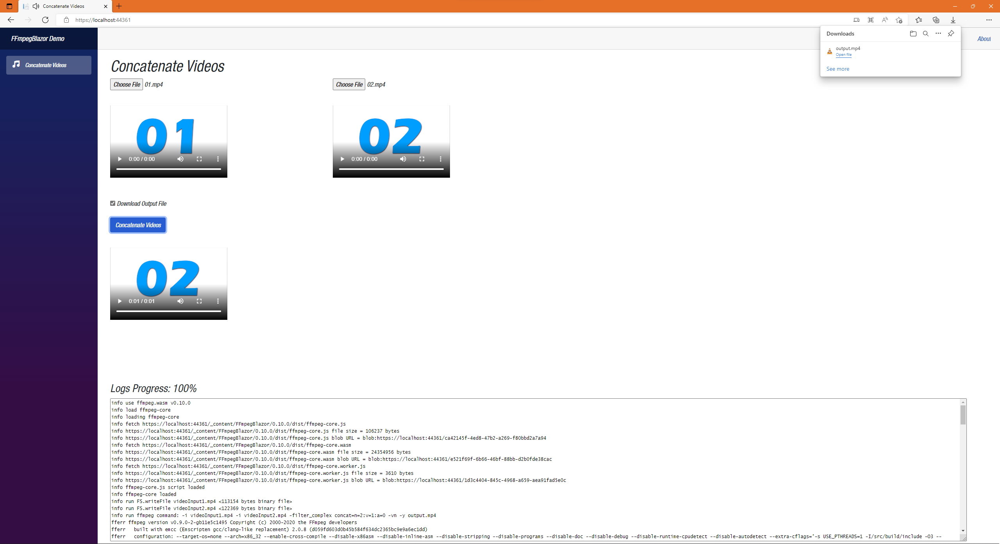  

## Summary

For more information about Blazor, check the links in the resources section below.

## Complete Code

The complete code for this demo can be found in the link below.

- <https://github.com/payini/FFmpegBlazorDemo>

## Resources

| Resource Title                   | Url                                                                        |
| -------------------------------- | -------------------------------------------------------------------------- |
| The .NET Show with Carl Franklin | <https://www.youtube.com/playlist?list=PL8h4jt35t1wgW_PqzZ9USrHvvnk8JMQy_> |
| Download .NET                    | <https://dotnet.microsoft.com/en-us/download>                              |
| FFmpegBlazor                     | <https://github.com/sps014/FFmpegBlazor>                                   |
| FFmpegBlazor NuGet Package       | <https://www.nuget.org/packages/FFmpegBlazor/>                             |
| FFmpeg Documentation             | <https://ffmpeg.org/ffmpeg.html>                                           |
